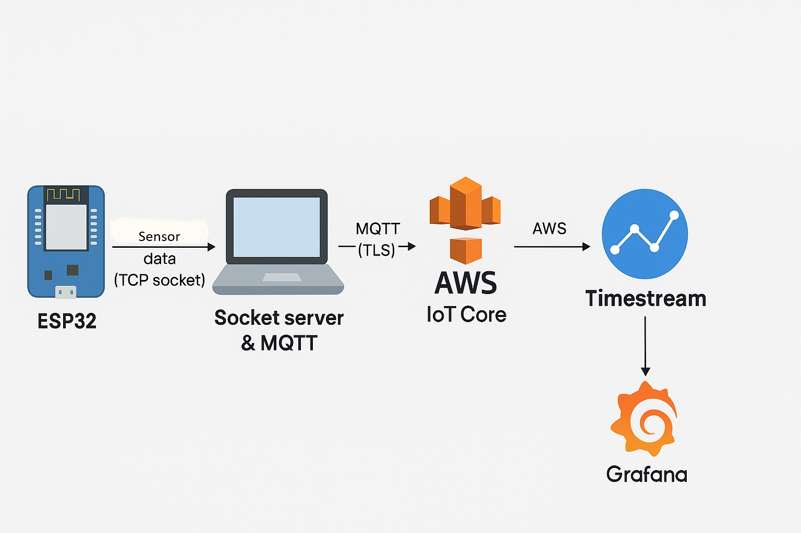

# ESP2Cloud

A complete end-to-end IoT project that collects sensor data on an ESP32 device using MicroPython, sends it via TCP sockets to a laptop server, and publishes it to AWS IoT Core using MQTT with TLS encryption. The data is stored in **Timestream** and visualized in **Grafana**.

---

## 📦 Features

- ESP32 MicroPython TCP Client
- Python Socket Server on Laptop
- MQTT over TLS to AWS IoT Core
- AWS Rule for Timestream integration
- Real-time dashboards with Grafana
- Secure, scalable, and reliable data flow

---

## 🔧 System Architecture

```mermaid
graph LR
    ESP32[ESP32 (Sensor Data)]
    Laptop[Laptop (Python TCP Server)]
    AWS[AWS IoT Core (MQTT over TLS)]
    DB[AWS Timestream (Time-series DB)]
    Grafana[Grafana (Visualization)]

    ESP32 -- TCP Socket --> Laptop
    Laptop -- MQTT + TLS --> AWS
    AWS -- Rule --> DB
    DB -- Query --> Grafana
````

---

## 🚀 Getting Started

### 1. 🧠 Prerequisites

* ESP32 with MicroPython firmware
* Laptop with Python 3.x
* AWS IoT Core set up with:

  * Thing, certificates, policy
  * Rule to forward MQTT to Timestream
* Grafana (hosted or local)
* Timestream database and table

---

### 2. 🧱 Project Structure

```
.
├── esp32_client/ # MicroPython code for ESP32
│   ├── config.py
│   ├── data_pusher.py # TCP socket client code
│   ├── input_reader.py     
│   ├── main.py
│   ├── sensor.py
│   └── wifi_client.py #wifi setup code
├── gateway/
│   ├── gateway.py
│   └── mqtt.py    # Python TCP server + MQTT publisher
├── cloud/
│   ├── api_server.py # Webpage created to run locally using Flask
│   ├── server.py
│   └── mqtt.py    # Python TCP server + MQTT publisher
├── iotcerts/
│   ├── root-CA.crt
│   ├── device-cert.pem.crt
│   └── private.pem.key
├── ESP32_GENERIC-20250415-v1.25.0.
├── Achitecture of system.png               # System architecture
├── .env  #environment variables for sensitive information
├── cp.bat
├── flash_esp.bat
└── README.md
```

---

### 3. 📡 ESP32 Setup
Install dependencies:

```
pip install esptool
pip install mpremote
```
* Flash MicroPython firmware to ESP32 using `flash_esp.bat`
* Upload Micropython files using `cp.bat`
* Update `HOST`, `PORT`, and Wi-Fi credentials in the code
* Run socket client using command ` mpremote connect COM5 run .\esp32_client\main.py`

---

### 4. 🖥️ Python Server (Laptop)

Install dependencies:

```bash
pip install paho-mqtt
```

Run:

```bash
python .\gateway\gateway.py
```

Make sure to set:

* Your **AWS IoT endpoint**
* Paths to **certs**
* Correct **MQTT topic** and **port (8883)**
---
### (Optional) 5. 🖥️ MQTT Subscriber (Localhost) 
Install dependencies:

```bash
pip install Flask
pip install Flask-Cors
```
---

## 🔐 Security

* TLS v1.2 encryption between Laptop and AWS IoT Core
* Uses official **Amazon Root CA** and device certificates
* ESP32 TCP connection is within a local trusted network

---

## 📊 Visualization

* AWS Timestream stores the time-series sensor data
* Grafana queries Timestream with SQL-like language
* Dashboards update in real time

---

## ❌ Challenges Faced

* ESP32 Wi-Fi drops causing socket failures
* Manual encoding/decoding over TCP socket
* TLS handshake and cert issues with AWS IoT
* JSON structure mismatches for Timestream ingestion

---

## 🧠 Future Improvements

* Add retry logic and buffering on ESP32
* Implement bi-directional MQTT for control commands
* Use NTP sync or timestamp injection for better timing
* Deploy socket server to a Raspberry Pi for 24/7 operation

---

## 🛠 Tools & Technologies

* MicroPython
* Python 3.x
* AWS IoT Core
* MQTT (TLS-secured)
* AWS Timestream
* Grafana
* TCP/IP, Wi-Fi

---

## 📸 System Diagram




